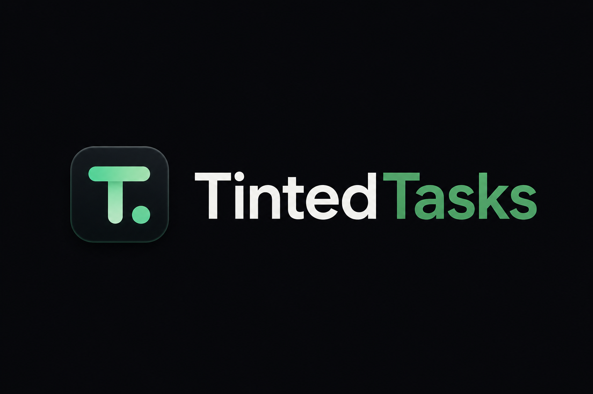

<p align="center">
  
</p>

# Tinted Tasks

Tinted Tasks is a local-first kanban workspace for single-user planning. It runs entirely in the browser, stores work on the device, and can be installed like a lightweight app without accounts, sync setup, or backend infrastructure.

Tinted Tasks v1 is for people who want a focused planning tool that opens fast, stays simple, and keeps ownership of data local.

## v1.0.0

Tinted Tasks v1 is built for people who want:

- a focused personal planning board
- a browser app that feels lightweight and installable
- local ownership of data with JSON backup and restore
- board grouping without collapsing separate boards into one large workspace

## Features

- Start with a blank workspace instead of seeded demo content
- Create, rename, delete, group, and unmerge boards
- Add, edit, delete, and drag tasks between columns
- Resize any board between 2 and 8 columns
- Collapse and reopen the sidebar with a hamburger menu
- Install the app as a PWA on supported browsers
- Show an in-app install prompt when the browser exposes `beforeinstallprompt`
- Cache the app shell for offline reuse after the first successful load
- Show versioned in-app notices when the offline cache is ready or updated
- Reopen the latest in-app changelog from Settings on demand
- Export and import JSON backups for recovery and device-to-device transfer
- Export the current board as a PDF snapshot
- Switch between light and dark themes from Settings

## Install The App

Tinted Tasks can be used directly in the browser or installed as a PWA on supported browsers.

### Use In The Browser

1. Open the app in a supported browser.
2. Create a board when you are ready to start.
3. Your workspace is saved locally in that browser unless you clear storage.

### Install As An App

Tinted Tasks can be installed once it is deployed or running from a production preview.

### Chrome or Edge

1. Open Tinted Tasks in the browser.
2. Use the in-app install prompt when it appears.
3. If the prompt does not appear, open the browser menu and choose `Install Tinted Tasks` or `Add to desktop`.

### iPhone or iPad

1. Open Tinted Tasks in Safari.
2. Tap the Share button.
3. Choose `Add to Home Screen`.

### Android

1. Open Tinted Tasks in Chrome.
2. Accept the install prompt, or open the browser menu.
3. Choose `Install app` or `Add to Home screen`.

After installation, Tinted Tasks opens like a standalone app and reuses its cached shell offline after the first successful load.

## Product Boundaries

- Single-user only
- No accounts, sync, or collaboration
- Browser-local persistence only
- Clearing browser storage removes saved boards unless you exported a backup
- PDF export is intended for small to medium boards and may struggle with very large layouts

## PWA And Offline

Tinted Tasks is installable and supports offline shell caching.

What that means in practice:

- after the app loads successfully once, core shell files are cached for later offline reuse
- supported browsers can show an in-app install banner
- the app shows an in-app notice when the offline cache is first ready or when it updates to a new cache version
- an offline fallback page is available when a requested page was not cached yet

This is still a local-first web app, not a cloud-synced offline system. Your board data is stored in browser storage on the device.

## Backups And Recovery

- Export a JSON backup from Settings when you want a portable copy of your workspace.
- Import that JSON backup on the same device or another device to restore boards.
- PDF export is for sharing or snapshots, not for recovery.

## Release Notes

### v1.0.0

- Released Tinted Tasks as a local-first single-user planning workspace
- Added installable PWA support with offline shell caching and update notices
- Added JSON backup and restore for local data portability
- Added PDF export for board snapshots
- Added board grouping, unmerge, and per-board column resizing
- Added browser-level Playwright coverage for the critical v1 flow

## Running Locally

### Prerequisites

- Node.js 20+
- npm 10+

### Install Dependencies

```bash
npm install
```

### Start Development

```bash
npm run dev
```

### Preview Production Locally

```bash
npm run build
npm run preview
```

### Install Locally For Testing

To test installation behavior locally, run the production preview and open the preview URL in a supported browser:

```bash
npm run build
npm run preview
```

Install prompts and service worker behavior are intended to be checked against the production preview rather than the development server.

## Deploy To GitHub Pages

Tinted Tasks is configured to deploy as a GitHub Pages project site under:

- `https://tintedtechnologies.github.io/tintedtasks/`

### Repository Setup

1. Push this project to the repository that should publish the app.
2. In GitHub, open `Settings -> Pages`.
3. Set the source to `GitHub Actions`.
4. Push to `main` to trigger the workflow in `.github/workflows/deploy.yml`.

### Important Notes

- The Vite base path is configured for `/tintedtasks/`.
- The manifest and service worker are configured for project-site deployment rather than root-site deployment.
- If you change the repository path later, update the base path in `vite.config.ts`.

## Validation

```bash
npm run lint
npm run test
npm run test:e2e
npm run build
```

## Tech Stack

- React 19
- TypeScript 5
- Vite 8
- dnd-kit for drag and drop
- html2canvas and jsPDF for PDF export
- Vitest for unit and smoke coverage
- Playwright for browser-level end-to-end coverage

## Project Structure

```text
src/
  App.tsx                   App shell and top-level interactions
  components/               Board columns, task modal, settings modal
  lib/tintedTasks.ts         Pure board and card state helpers
  lib/persistence.ts        localStorage load/save helpers
public/
  logo.png                  README logo asset
  manifest.webmanifest      PWA manifest
  sw.js                     Service worker for installability and offline caching
  offline.html              Offline fallback page
```

## Testing Notes

The automated coverage currently checks the most important local-first flows:

- board creation
- card creation
- card movement between columns
- persistence load and save behavior
- column resizing with card carry-over
- backup import and export validation
- board grouping behavior
- grouped-board persistence after reload
- offline reuse through the Playwright production-preview flow

## Status

Tinted Tasks `1.0.0` is positioned as a complete v1 for single-user local-first planning. It is not intended to be a collaborative or cloud-synced product in this release.
